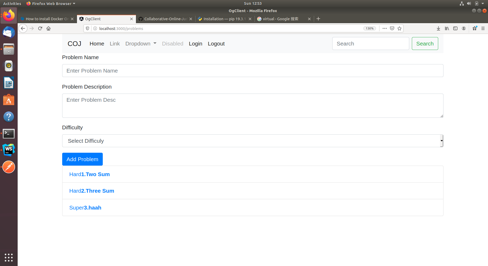
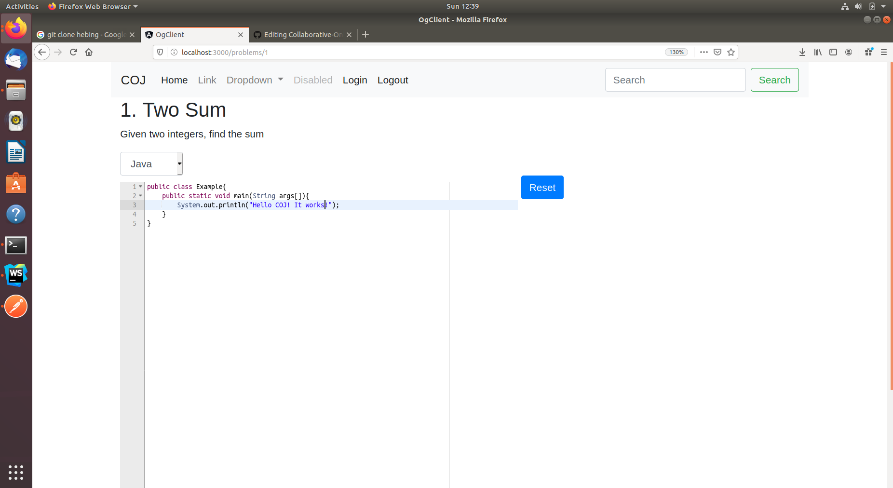
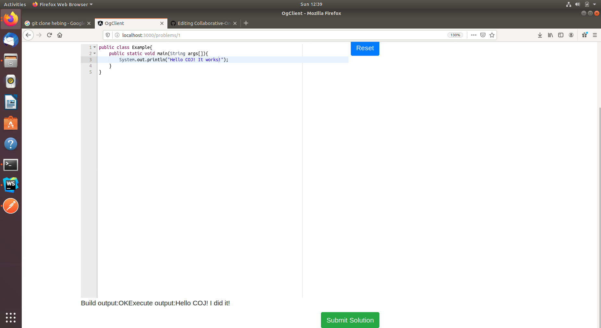

# Collaborative-Online-Judge

A collaborative online judge system 

Implemented CRUD operations of the OJ problems and the collaborative ACE editor by WebSocket. 
The front-end is built by Angular and Bootstrap. Then back-end is implemented by Node.js and MongoDB.
Built backend executor server with Flask and run the codes in the Docker virtual environment





## Getting Started

This project is being developed on the Ubantu18.04 system. 

### Prerequisites

First, we should install Node.js and meanwhile you will get a npm as well.
you can also check this: https://github.com/nodesource/distributions/blob/master/README.md

```
# Using Ubuntu
curl -sL https://deb.nodesource.com/setup_13.x | sudo -E bash -
sudo apt-get install -y nodejs
```
then you can use npm to install Angular-cli

```
npm install -g @angular/cli
```
Install pip with default Python 2.7

```
sudo apt install python-pip
```

Install Docker https://phoenixnap.com/kb/how-to-install-docker-on-ubuntu-18-04

```
sudo apt install docker.io
```


Install MongoDB https://docs.mongodb.com/manual/tutorial/install-mongodb-on-ubuntu/


### Installing

start MongoDB service (assuming that you have followed above instructions)

```
sudo service mongod start
```

Clone this repo 

cd to the ./week1/og-client/

do

```
npm install
```

cd to the ./week1/oj-server/

do

```
npm install
```

cd to the ./week1/executor/

do

```
pip install -r requirements.txt
```


## Running the tests

build the client code
```
cd  ./week1/og-client/
ng build --watch
```

start the server
```
cd  ./week1/oj-server/
node server.js
```

start the executor server
```
cd  ./week1/executor/
python executor_server.py
```

open the brower: localhost:3000/


## Authors

* **Yang Guo** 

